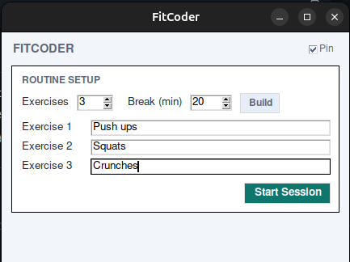
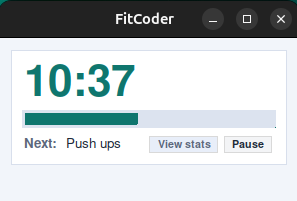
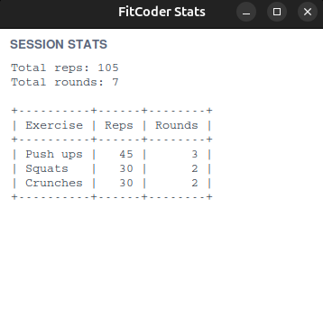

# Fit Coder

`fit-coder` is a small app that reminds programmers to exercise during long work sessions.

## Features

- Routine setup in the widget (exercise count, names, break length)
- Compact movable timer widget with progress bar and `Next` exercise info
- Reps logging after each break and per-exercise stats table
- Alarm when break time is over, with click-to-mute support
- CLI fallback when `tkinter` or GUI display is unavailable

## Quick Start

Run locally:

```bash
python3 fit_coder.py
```

Install as global command:

```bash
ln -sf "$(pwd)/fit_coder.py" ~/.local/bin/fitcoder
fitcoder
```

## Screenshots

Setup:



Timer:



Stats:


